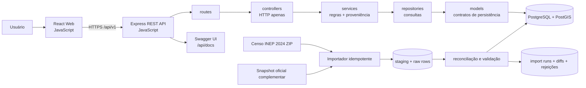
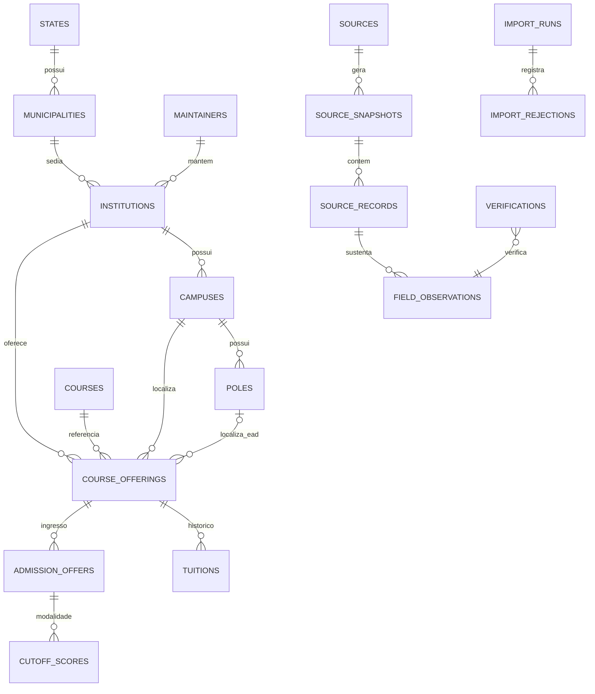
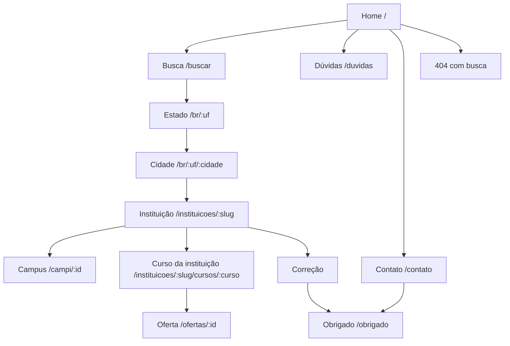

# Faculdade Perto — definição técnica antes do código

Status: proposta para aprovação  
Escopo: Fase 1  
Data da análise: 21/08/2026  
Base oficial examinada: Microdados do Censo da Educação Superior 2024, pacote atualizado pelo INEP em 10/07/2026

## 1. Decisão executiva

A Fase 1 será implementada como uma aplicação React em JavaScript e uma API REST própria em JavaScript, com PostgreSQL + PostGIS. A API seguirá obrigatoriamente `routes → controllers → services → repositories → models`; validação, regras de negócio, proveniência e política de ausência ficam em `services`, nunca em controllers ou componentes.

Há uma incompatibilidade objetiva entre o critério de aceite original e a base pública indicada. O pacote oficial do Censo 2024 contém:

- cadastro de IES, com endereço apenas da sede administrativa/reitoria;
- cadastro de cursos agregado por IES, município/dimensão geográfica, modalidade e grau;
- nenhuma entidade de campus ou polo;
- nenhum endereço de local de oferta de curso;
- nenhum turno identificador de uma oferta; existem somente totais agregados diurno/noturno;
- nenhuma situação regulatória `ativo/inativo` de curso;
- nenhuma mensalidade, nota de corte ou vaga por modalidade de concorrência.

Consequência: o Censo sozinho permite publicar uma busca nacional verdadeira por IES e por agregados de curso/município, mas não permite criar honestamente `Campus`, `Polo` e `CourseOffering (curso × campus × modalidade × turno)`. Fazer isso exigiria inferir entidades que a fonte não contém, contrariando o princípio central do produto.

Portanto, a Fase 1 deve ser dividida em dois marcos, sem fingir que o primeiro satisfaz o segundo:

1. **Fase 1A — base nacional auditável:** IES, mantenedoras, municípios, catálogo de cursos e agregados de cursos do Censo 2024, sempre com status `importado`.
2. **Fase 1B — ofertas/localizações verificáveis:** integrar uma fonte oficial complementar versionada que identifique situação do curso e local de oferta. Até essa fonte existir e passar por reconciliação, páginas de campus, polo e oferta não são publicadas como fatos confirmados.

O CSV aberto do e-MEC publicado pelo MEC em 2022 pode ajudar na situação regulatória e em vagas autorizadas, mas está desatualizado e também não deve ser tratado como uma API viva. Ele só pode entrar como snapshot separado, com data visível e reconciliação explícita.

## 2. Arquitetura do MVP



### 2.1 Componentes e responsabilidades

| Componente | Responsabilidade | Não pode fazer |
|---|---|---|
| React Web | renderização, acessibilidade, estado de interface e chamadas à API | decidir se dado é confirmado, calcular distância oficial ou inventar fallback |
| Routes | declarar método, path, validação estrutural e middleware | regra de negócio |
| Controllers | traduzir HTTP para chamada de service e serializar resposta | consultar banco diretamente, classificar dado ou construir mensagem de domínio |
| Services | busca, filtros, proveniência, `nao_confirmado`, idempotência, reconciliação e mensagens úteis | depender de detalhes HTTP |
| Repositories | SQL parametrizado, paginação, PostGIS e transações | regra editorial ou de confiança |
| Models | nomes, constraints e contratos persistidos | lógica de apresentação |
| Importador | baixar/receber snapshot, verificar hash, carregar staging, validar, reconciliar e promover | sobrescrever histórico ou marcar como verificado manualmente |

### 2.2 Stack proposta

- Frontend: React + Vite, JavaScript, React Router, TanStack Query e Leaflet.
- Backend: Node.js LTS + Express, JavaScript, OpenAPI 3.1/Swagger UI, Zod para entrada e saída.
- Banco: PostgreSQL 16+ com PostGIS; migrations versionadas.
- Testes: Vitest no frontend e backend, Supertest para API e Testcontainers/PostgreSQL para integrações críticas.
- Observabilidade: logs JSON com `requestId`, métricas de importação e auditoria sem stack trace na resposta pública.

### 2.3 Contrato obrigatório de proveniência

Todo campo variável público é serializado por um único service:

```json
{
  "value": null,
  "status": "nao_confirmado",
  "source": null,
  "sourceUrl": null,
  "updatedAt": null,
  "reason": "O Censo INEP 2024 não publica mensalidade."
}
```

Regras:

- `confirmado`: somente verificação adicional registrada em `verifications` sustenta o status;
- `importado`: valor lido de snapshot íntegro e rastreável, sem checagem manual adicional;
- `nao_confirmado`: `value = null`, motivo obrigatório e nenhum valor estimado;
- ausência de fonte ou snapshot impede `confirmado` e `importado` por constraint e por teste;
- uma correção colaborativa nunca altera diretamente o dado público: entra na fila de revisão.

## 3. Esquema do banco



### 3.1 Tabelas nucleares

| Tabela | Chaves e campos principais | Regra crítica |
|---|---|---|
| `states` | `id`, `ibge_code`, `name`, `abbreviation` | UF por código IBGE, não por texto livre |
| `municipalities` | `id`, `ibge_code`, `state_id`, `name` | código IBGE único |
| `maintainers` | `id`, `inep_code`, `name` | histórico via observações; não sobrescrever silenciosamente |
| `institutions` | `id`, `inep_code`, `maintainer_id`, `headquarters_municipality_id`, `name`, `acronym`, `academic_organization`, `administrative_category`, `education_network` | sede não é sinônimo de campus |
| `campuses` | `id`, `institution_id`, `external_code`, `municipality_id`, `name`, `address`, `location`, `status` | só nasce quando a fonte identifica o local; nunca derivado da sede |
| `poles` | `id`, `institution_id`, `campus_id?`, `external_code`, `municipality_id`, `name`, `address`, `location`, `status` | não criar um polo para cada município agregado de EAD |
| `courses` | `id`, `cine_code`, `canonical_name`, `cine_area_*` | curso abstrato canônico por CINE; nome institucional fica na oferta/registro de catálogo |
| `course_catalog_records` | `id`, `institution_id`, `course_id`, `inep_course_code`, `municipality_id?`, `dimension`, `degree`, `modality`, `level`, `census_year`, `source_record_id` | representa fielmente a linha agregada do Censo; não se chama oferta |
| `course_offerings` | `id`, `institution_id`, `course_id`, `campus_id?`, `pole_id?`, `external_code`, `degree`, `modality`, `shift`, `status` | requer fonte complementar; `campus/pole` e turno não podem ser inferidos dos totais |
| `sources` | `id`, `name`, `publisher`, `canonical_url`, `license` | fonte institucional estável |
| `source_snapshots` | `id`, `source_id`, `reference_period`, `published_at`, `retrieved_at`, `sha256`, `original_url`, `schema_version` | imutável; hash único |
| `source_records` | `id`, `snapshot_id`, `dataset`, `natural_key`, `raw_payload`, `row_hash` | permite auditoria campo a campo |
| `field_observations` | `id`, `entity_type`, `entity_id`, `field_name`, `value_json`, `status`, `source_record_id`, `observed_at`, `valid_from`, `valid_to` | append-only; fonte obrigatória para `importado/confirmado` |
| `verifications` | `id`, `observation_id`, `method`, `status`, `reviewer_id?`, `evidence_url`, `verified_at`, `notes` | é a única promoção para `confirmado` |
| `course_statistics` | chave do registro + `metric`, `value`, `year`, `source_record_id` | guarda agregados `QT_*` sem convertê-los em oferta individual |
| `tuitions` | `offering_id`, `year`, `semester`, `regular_amount`, `promotional_amount?`, `currency`, proveniência | promoção exige regular ao lado; histórico append-only |
| `admission_offers` | `offering_id`, `program`, `edition`, `year`, `semester`, `seats`, proveniência | SiSU, ProUni, Fies e vestibular nunca misturados |
| `cutoff_scores` | `admission_offer_id`, `competition_modality`, `score`, `round`, proveniência | unique por edição + modalidade + rodada; sem média entre cotas |
| `import_runs` | `id`, `snapshot_id`, `status`, contadores, timestamps | `(snapshot_id, importer_version)` idempotente |
| `import_rejections` | `import_run_id`, `dataset`, `row_number`, `code`, `message`, `raw_payload` | rejeição não é descartada |
| `contacts` | campos do formulário, `status`, timestamps | validação e rate limit |
| `corrections` | alvo, descrição, evidência, contato, `status`, timestamps | moderação obrigatória |

### 3.2 Constraints inegociáveis

- `CHECK (status = 'nao_confirmado' OR source_record_id IS NOT NULL)` em observações.
- `CHECK (status <> 'confirmado' OR EXISTS verification aceita)` aplicado no service e garantido por trigger/constraint equivalente.
- `CHECK (promotional_amount IS NULL OR regular_amount IS NOT NULL)`.
- `CHECK (campus_id IS NOT NULL OR pole_id IS NOT NULL)` para oferta publicável presencial/localizada.
- `UNIQUE (admission_offer_id, competition_modality, round)` em notas de corte.
- nenhuma atualização destrutiva em tabelas de histórico; nova observação fecha a anterior com `valid_to`.

## 4. Mapeamento do Censo 2024

O inventário completo, coluna por coluna, está em `docs/censo-2024-field-map.md`. As decisões são:

- **direto:** pode preencher entidade, sempre como `importado`;
- **enum:** código original é preservado e traduzido por tabela versionada do dicionário;
- **estatística:** permanece histórica e agregada; não cria uma oferta individual;
- **somente raw na Fase 1:** preservado para auditoria/enriquecimento, mas não exposto como atributo nuclear;
- **não disponível:** deve ser exibido como `nao_confirmado` quando a página exigir o campo.

### 4.1 Chaves naturais e granularidade real

| Dataset | Chave de importação | Granularidade |
|---|---|---|
| `MICRODADOS_ED_SUP_IES_2024.CSV` | `NU_ANO_CENSO + CO_IES` | uma IES, com endereço da sede/reitoria |
| `MICRODADOS_CADASTRO_CURSOS_2024.CSV` | `NU_ANO_CENSO + CO_IES + CO_CURSO + TP_DIMENSAO + CO_MUNICIPIO + TP_GRAU_ACADEMICO + TP_MODALIDADE_ENSINO + TP_NIVEL_ACADEMICO` mais ordinal controlado se houver duplicata idêntica | agregado de curso por dimensão geográfica; não é campus/oferta |

Antes de promover dados, o importador deve testar unicidade real e registrar qualquer colisão. Nunca acrescentar turno à chave: o arquivo traz métricas diurno/noturno, não uma coluna de turno da oferta.

### 4.2 Campos explicitamente `nao_confirmado` após importar somente o Censo

| Entidade/tela | Campo | Motivo público sugerido |
|---|---|---|
| Campus | existência, nome, código, endereço, latitude/longitude | “O microdado público do Censo 2024 informa a sede da IES, mas não identifica este campus.” |
| Polo | todos | “O Censo 2024 não publica polos como registros individualizados.” |
| Oferta | campus/polo e turno individual | “O arquivo publica totais agregados, não uma oferta identificada por local e turno.” |
| Curso/oferta | situação regulatória ativa/inativa | “A situação regulatória não faz parte deste snapshot do Censo.” |
| Oferta | mensalidade regular/promocional | “O Censo INEP não publica mensalidades.” |
| Oferta | bolsas vigentes | “Não há fonte de bolsa vinculada a esta oferta neste snapshot.” |
| Oferta | nota de corte | “Notas de corte são carregadas por edição e modalidade; nenhuma foi confirmada para esta oferta.” |
| Oferta | vagas futuras/atuais | “O Censo informa contagens do ano de referência, não disponibilidade atual.” |
| Instituição/campus | telefone, e-mail, site, fotos, infraestrutura por unidade | “Campo não publicado neste arquivo ou não verificado para a unidade.” |
| Distância/raio | distância de campus | “Não há coordenada verificada para este campus.” |

### 4.3 Uso permitido de contagens

`QT_VG_*`, `QT_INSCRITO_*`, `QT_ING_*`, `QT_MAT_*`, `QT_CONC_*`, financiamento, reserva de vagas, apoio social e mobilidade são estatísticas do ano de referência. Elas podem aparecer apenas com rótulo temporal explícito, fonte e granularidade. Não representam vagas abertas agora, mensalidade, nota de corte nem chance de aprovação.

## 5. Mapa de páginas



### 5.1 Publicação progressiva sem rotas falsas

- Na 1A são indexáveis: home, busca, estado, cidade, instituição, dúvidas, contato e 404.
- Página de “curso na instituição/cidade” na 1A deve se identificar como **registro agregado do Censo**, não como campus ou turma disponível.
- Campus e oferta só entram no sitemap quando possuírem fonte complementar válida e a entidade mínima publicável.
- Uma rota conhecida sem evidência suficiente responde página útil com `noindex` e dados `nao_confirmado`; não cria conteúdo factual sintético.

### 5.2 SEO e semântica por página

| Página | H1 único | JSON-LD | Links internos mínimos |
|---|---|---|---|
| Home | “Encontre faculdades e cursos perto de você” | `FAQPage`, `WebSite` | cidades procuradas, dúvidas, busca |
| Estado | “Faculdades em {UF}” | `BreadcrumbList` | cidades do estado, instituições |
| Cidade | “Faculdades e cursos em {cidade}” | `BreadcrumbList`, `ItemList` | instituições, cursos, cidades próximas |
| Instituição | nome oficial da IES | `EducationalOrganization`, `BreadcrumbList` | município-sede, registros de curso, próximas |
| Curso agregado | “{curso} em {cidade}” | `Course`, `BreadcrumbList` com ressalva de granularidade | instituição, mesmo CINE em outras cidades |
| Oferta | nome + instituição + local | `Course`, `BreadcrumbList` | campus, instituição, ofertas comparáveis |
| Dúvidas | “Dúvidas sobre faculdades e dados” | `FAQPage` | busca e páginas explicativas |

## 6. Fluxos principais

### 6.1 Importação idempotente

1. registrar URL, data de obtenção, hash SHA-256 e metadados do snapshot;
2. validar encoding, separador, cabeçalho exato e dicionário esperado;
3. copiar linhas para staging sem transformação destrutiva;
4. validar enums, chaves e nulos especiais como `(.)`;
5. fazer upsert apenas da identidade estável;
6. inserir novas observações históricas quando `row_hash` ou campo mudar;
7. não duplicar observações quando o mesmo snapshot for reprocessado;
8. gerar diff, contadores e rejeições;
9. promover a importação inteira em transação, ou manter a versão anterior ativa.

### 6.2 Busca

- busca textual normalizada por curso/CINE, IES, município e UF;
- filtros preservam as categorias: pública/privada; presencial/EAD; bacharelado/licenciatura/tecnólogo/ABI;
- resultados agregados da 1A nunca recebem distância de campus;
- busca por raio somente consulta campi/polos com geometria verificada;
- erro vazio cita a cidade e sugere ação real, por exemplo ampliar raio apenas quando houver geodados.

## 7. API da Fase 1

Todos os paths ficam sob `/api/v1`; `/api/docs` publica OpenAPI 3.1 com exemplos.

| Endpoint | Marco | Observação |
|---|---|---|
| `GET /institutions` e `/:id` | 1A | paginação, UF, município, rede e categoria |
| `GET /courses` | 1A | curso canônico/CINE e registros agregados |
| `GET /search` | 1A | deixa explícito `resultType: institution | census_course_record | offering` |
| `GET /campuses` | 1B | nunca transforma sede em campus |
| `GET /campuses/nearby` | 1B | PostGIS, raio validado, somente coordenada verificada |
| `GET /offerings` e `/:id` | 1B | requer local e fonte complementar |
| `GET /cutoffs` | estrutura na 1A, dados na Fase 2 | modalidades separadas |
| `POST /enem/score` | Fase 2 | não antecipar na publicação da 1A |
| `POST /contact` | 1A | validação campo a campo e rate limit |
| `POST /corrections` | 1A | fila moderada e rate limit |
| `GET /sitemap-data` | 1A | somente entidades publicáveis |

Erros seguem `{ "error": { "code", "message", "hint", "fields"? } }`. Controllers nunca devolvem stack trace.

## 8. Riscos conhecidos e respostas

| Risco | Impacto | Resposta/critério de bloqueio |
|---|---|---|
| Censo não identifica campus/polo/oferta individual | crítico | publicar 1A sem esses fatos; 1B exige fonte complementar |
| EAD sem município em dimensões agregadas | alto | não associar a município; mostrar alcance geográfico não confirmado |
| Censo 2024 é histórico, não catálogo vivo | alto | “ano de referência 2024”, nunca “disponível agora” |
| CSV e dicionário podem mudar mantendo o ano | alto | snapshot imutável, hash, schema version e falha fechada em cabeçalho inesperado |
| Homônimos de curso | médio | canonização por CINE; manter nome original institucional |
| Código ausente de grau em ABI/outros | médio | não deduzir; `nao_confirmado`/enum próprio |
| Endereço da sede confundido com campus | crítico | nomes de campo e UI dizem “sede administrativa”; teste de regressão |
| Geocodificação errada | alto | coordenada importada fica `importado`; busca por raio exige limiar e revisão conforme política definida na Fase 3 |
| Totais agregados virarem “vagas abertas” | crítico | modelar como `course_statistics`, com ano; proibir projeção em `AdmissionOffer` |
| Categorias indevidamente agregadas | crítico | dimensões em chave/constraint; testes de service |
| Grande volume e busca lenta | médio | `COPY` para staging, índices GIN/trigram e PostGIS, paginação cursor/limitada |
| LGPD em contato/correção | médio | minimização, retenção e acesso restrito; nenhuma exposição pública |
| SEO de páginas sem evidência | alto | sitemap só com entidade publicável; `noindex` para insuficiência |

## 9. Critério de aceite

### 9.1 Fase 1A — possível com o Censo 2024

- o snapshot oficial tem URL, hash, data de obtenção, ano e versão de schema;
- executar o mesmo importador duas vezes mantém as mesmas cardinalidades e observações;
- todas as IES do arquivo são consultáveis por nome, município-sede e UF;
- todos os registros de curso do arquivo são consultáveis respeitando a granularidade real;
- cada valor público oriundo do arquivo mostra “Censo INEP 2024”, status `importado` e data do snapshot/importação;
- nenhum campo sem fonte aparece como confirmado ou recebe valor estimado;
- pública/privada, grau e modalidade permanecem dimensões distintas;
- sede administrativa nunca é rotulada como campus;
- totais de vagas/matrículas/ingressantes são apresentados como estatísticas de 2024, não disponibilidade atual;
- busca vazia e falha de validação explicam o ocorrido e a próxima ação;
- Swagger cobre todos os endpoints publicados, schemas, filtros, erros e exemplos;
- testes críticos de proveniência, idempotência e não agregação passam;
- sitemap contém apenas páginas com entidades publicáveis; titles, descriptions, H1, breadcrumbs e JSON-LD são únicos/validáveis.

### 9.2 Fase 1B — critério original de campus/oferta nacional

Só pode ser aceita quando, para uma amostra de todas as UFs e para qualquer cidade coberta:

- cada campus/polo tem identificador, município/endereço e fonte versionada;
- cada oferta liga curso, instituição, local, modalidade, grau e turno sem inferência silenciosa;
- situação ativa tem fonte regulatória com data;
- busca por cidade retorna somente locais de oferta comprovados naquela cidade;
- qualquer lacuna fica `nao_confirmado`, não exclui silenciosamente nem fabrica uma oferta;
- reconciliação entre Censo e fonte complementar tem relatório de conflitos e decisão auditável.

Até essas condições existirem, a frase “qualquer cidade retorna instituições e cursos reais daquela cidade” só é verdadeira para os agregados municipais presentes no Censo e deve ser descrita assim na interface.

## 10. Gate antes do primeiro commit de código

1. Aprovar a divisão 1A/1B ou indicar uma fonte oficial complementar que contenha campus/polo/oferta.
2. Aprovar PostgreSQL + PostGIS como banco do produto.
3. Aprovar que “curso em uma cidade” na 1A é um registro agregado do Censo, não uma oferta ativa.
4. Definir se o snapshot e-MEC aberto de 2022 será carregado apenas como referência histórica ou ficará fora da 1A.

Nenhum código de produto deve ser escrito antes desse gate, conforme solicitado na especificação.

## 11. Fontes verificadas

- INEP — Microdados do Censo da Educação Superior: https://www.gov.br/inep/pt-br/acesso-a-informacao/dados-abertos/microdados/censo-da-educacao-superior
- INEP — pacote 2024 examinado: https://download.inep.gov.br/microdados/microdados_censo_da_educacao_superior_2024.zip
- MEC — Cadastro Nacional de Cursos e IES (e-MEC): https://www.gov.br/mec/pt-br/politica-regulacao-supervisao-educacao-superior/cadastro-nacional-de-cursos-e-ies
- MEC — Indicadores sobre Ensino Superior, snapshot aberto de 2022: https://dadosabertos.mec.gov.br/indicadores-sobre-ensino-superior

